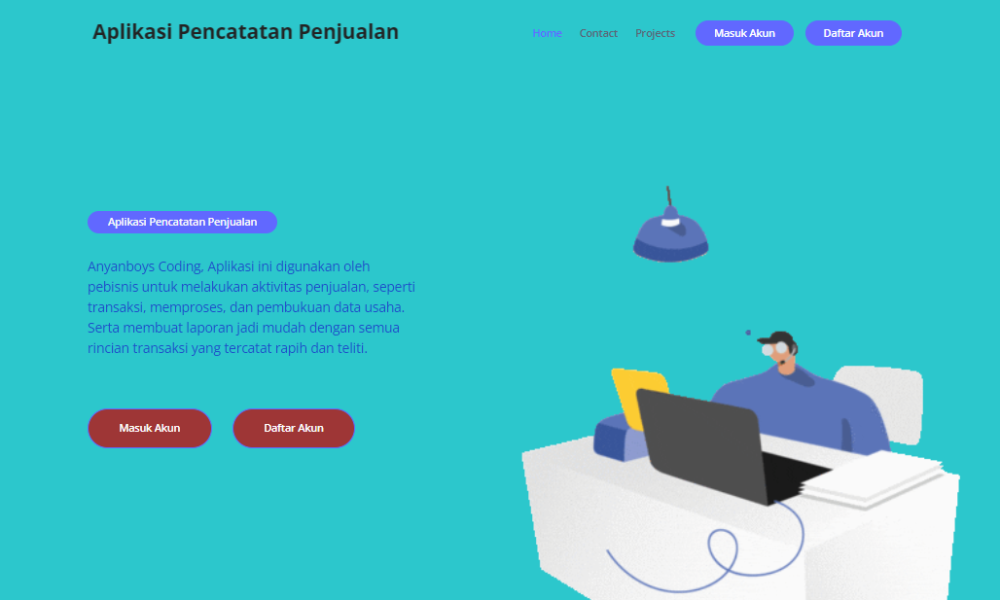
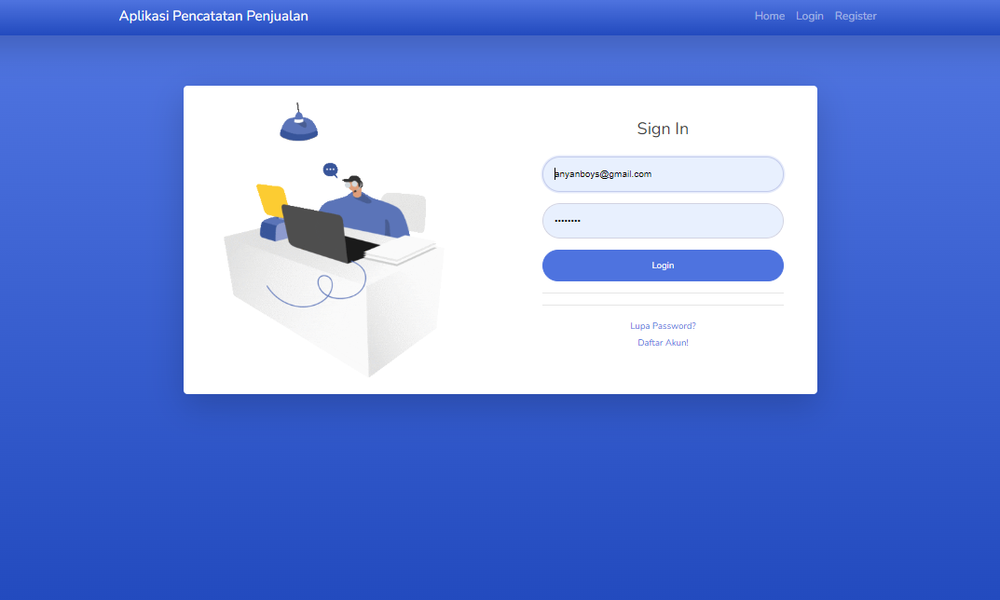
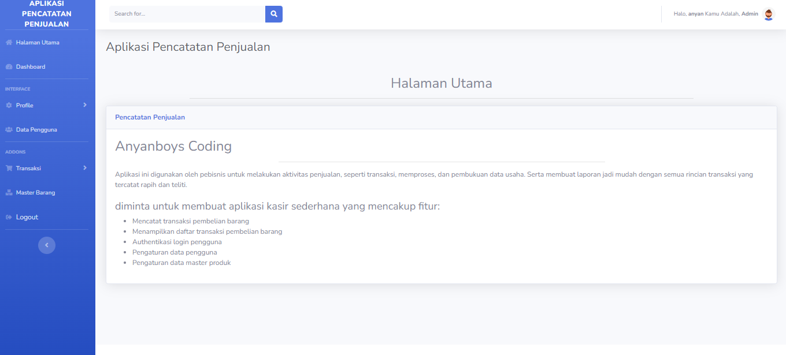
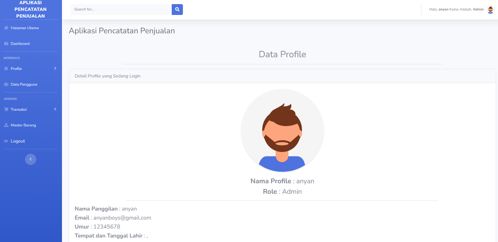
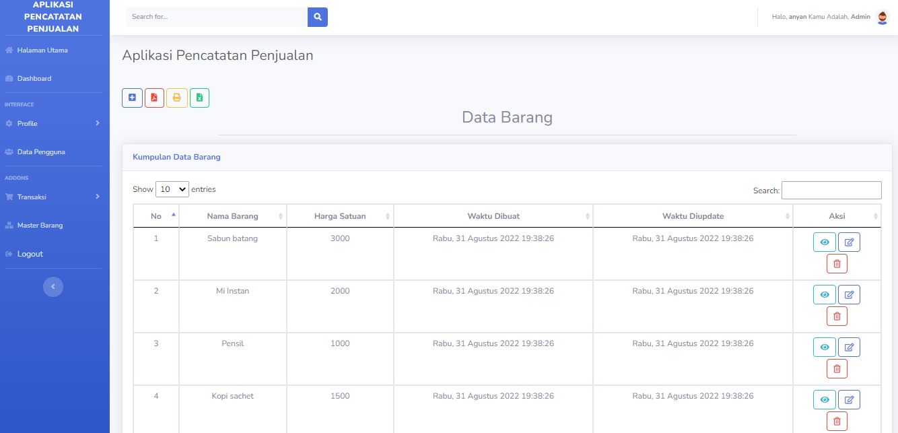
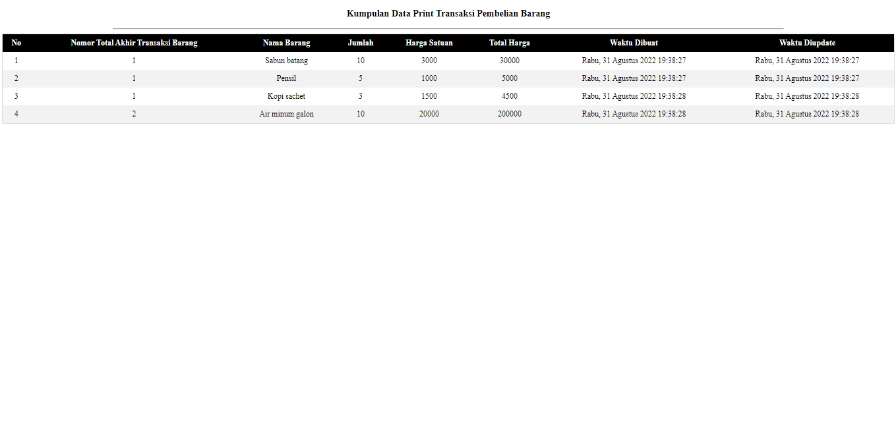

# Biodata

Nama : Anyan

Kelas : Laravel

Email : <a>anyanboys@gmail.com</a>

# Link Deploy

Deploy Heroku : https://github.com/Anyanboys/app_pencatatan_penjualan (Deploy Link Sudah Bisa)

## Portofolio Pencatatan Penjualan

Coding Camp Anyanboys (Laravel Project) 
Aplikasi ini digunakan oleh pebisnis untuk melakukan aktivitas penjualan, seperti transaksi, memproses, dan pembukuan data usaha. Serta membuat laporan jadi mudah dengan semua rincian transaksi yang tercatat rapih dan teliti, yang mencakup fitur:

1. Mencatat transaksi pembelian barang
2. Menampilkan daftar transaksi pembelian barang
3. Authentikasi login pengguna
4. Pengaturan data pengguna
5. Pengaturan data master produk

## Cara Instalasi ke Server Lokal :

-   Follow Github https://github.com/Anyanboys
-   Star Repo Github Saya
-   Fork Repo Github Saya
-   clone project repo saya dengan cara menuliskan pada terminal/cmd/git bash : git clone https://github.com/Anyanboys/app_pencatatan_penjualan
-   lalu masuk ke direktori repo yg sudah di clone dengan ketik lg pada terminal/cmd/git bash <b>cd Portofolio</b>
-   lalu ketik composser install dan php artisan key generate (jangan lupa salin dan setting file env)
-   migrate database pada terminal/cmd/git bash
-   jalankan php artisan db:seed pada terminal/cmd/git bash

Notes : Jika Sudah Menjalankan php artisan serve untuk mengakses alamat portofolio

## Aplikasi Screenshot

## Alat Yang Digunakan Untuk Membuat Web :

A. Hardware :
Laptop Aspire A314-32-C3X0. Speaksifikasi :

-   Ram : 4GB DD3 L Memory
-   Prosesor : Intel Core i5-4200U 1.6 GHz with Turbo Boost up to 2.5 GHz
-   Tipe System : 64 bit
-   VGA : NVIDIA GEFORCE GT 720M with 2GB Dedicated VRAM
-   SSD : 128 GB

B. Software :

-   XAMPP
-   Visual Studio Code
-   Sublime Merge
-   Git
-   PHP 7.4.9

C. Komponen

-   Laravel 8
-   Bootstrap 4 & 5

